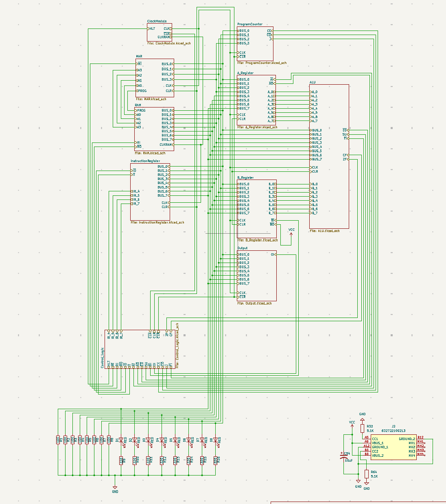
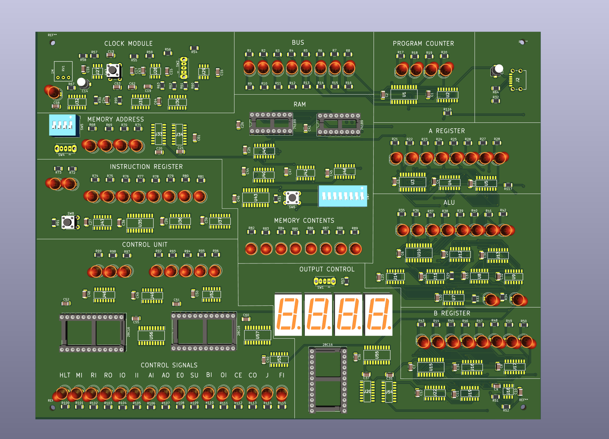

# 8-Bit TTL SAP-1 Computer

A simple **8-bit SAP-1 style computer** built entirely with **TTL logic chips**, based on Ben Eater’s design but redesigned for improved reliability and compactness. It uses a **Von Neumann architecture** (shared program and data memory) and is **Turing-complete**. The project includes a breadboard prototype and a PCB version in development using surface-mount components for a smaller, cheaper, and more robust build.

---

## Demo Video

---

## Project Overview

This project recreates the classic SAP-1 computer architecture with enhancements. The computer runs at clock speeds up to 500 kHz and includes an 8-bit ALU capable of addition, subtraction, and more complex operations like multiplication and division through software routines. It features a 4-bit program counter and memory address register, 32 bytes of memory with 8-bit words, two 8-bit general-purpose registers, an 8-bit data bus, and an output module with two 4-bit registers. The control unit is implemented using microcode stored in EEPROMs with 17 control flags.

---

## General Features

- Clock speed up to 500 kHz  
- 8-bit ALU capable of addition, subtraction, multiplication, and division (the latter two via software)  
- 4-bit Program Counter (PC) and Memory Address Register (MAR)  
- 32 bytes of memory, 8 bits per word  
- Two 8-bit general-purpose registers  
- 8-bit data bus  
- Output module with two 4-bit registers that can display signed and unsigned values via an instruction  
- Control Unit implemented with microcode EEPROMs using a total of 17 control flags  
- Built entirely with TTL chips  

---

## Images

### Breadboard Prototype

### Schematic and Organization

### PCB Layout (In progress)

---

## Instruction Set Architecture (ISA)

| Opcode | Instruction | Description                         |
|--------|-------------|-----------------------------------|
| 0000   | NOP         | No operation                      |
| 0001   | LDA addr    | Load accumulator from memory addr |
| 0010   | ADD addr    | Add memory value to accumulator    |
| 0011   | SUB addr    | Subtract memory value from accumulator |
| 0100   | STA addr    | Store accumulator to memory addr  |
| 0101   | LDI value   | Load immediate value into accumulator |
| 0110   | JMP addr    | Jump to address                   |
| 0111   | JC addr     | Jump if carry flag set            |
| 1110   | OUT         | Output accumulator                |
| 1111   | HLT         | Halt program                     |

---

## Future Plans

- Finalize PCB layout and routing for a compact, surface-mount design.  
- Improve and expand microcode for more instructions.  
- Add debugging and programming tools for easier development.  
- Share design files and documentation for the community.

---

*Note:* This project is based on an existing design by Ben Eater and others, adapted and improved based on hands-on experience with the breadboard version and the original PCB. The goal is to create a smaller, cheaper, and more reliable computer with enhanced features.

---

Feel free to clone, contribute, or suggest improvements!

---

© 2025 Hiram Rodriguez
